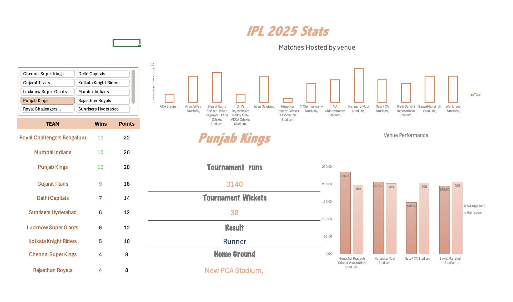

# 📊 My Data Analysis Portfolio

👋 Hi, I'm **Mahesh** – a recent Master's graduate in Data Science with a strong interest in **Data Analysis and Business Intelligence**.  
I enjoy working with data to uncover insights, build dashboards, and support decision-making.  

This portfolio highlights my projects in **Excel, SQL, and Power BI**, showcasing my ability to clean, analyze, and visualize data effectively.  
  
## 🏏 IPL Stats Dashboard

I created a dashboard using **Excel** where I:

- Took IPL data as CSV and transformed it in **Power Query**.  
- Created **slicers** for each team and a points table.  
- Displayed total tournament **runs**, **wickets**, and the result (**Winner, Runner-up, Playoffs**) when selecting a team.  
- Created a plot showing **number of matches hosted by each venue**.  
- Created a plot showing **average and maximum scores**.  

