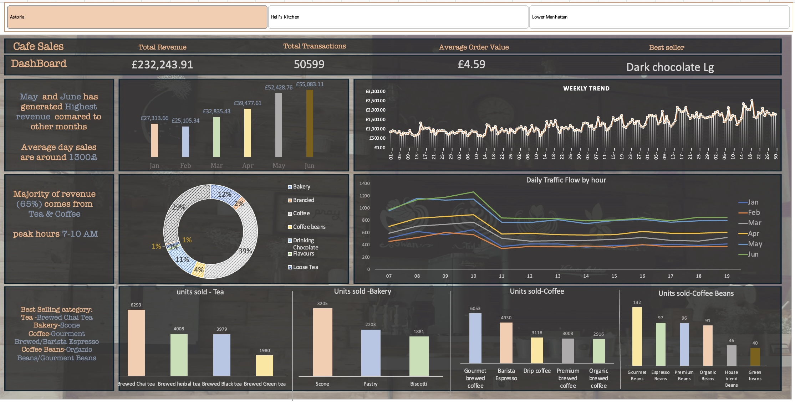

# 📊 My Data Analysis Portfolio

👋 Hi, I'm **Mahesh** – a recent Master's graduate in Data Science with a strong interest in **Data Analysis and Business Intelligence**.  
I enjoy working with data to uncover insights, build dashboards, and support decision-making.  

This portfolio highlights my projects in **Excel, SQL, and Power BI**, showcasing my ability to clean, analyze, and visualize data effectively.  
  
## 🏏 [IPL Stats Dashboard](./excel-IPL-stats-dashboard/README.md)

I created a dashboard using **Excel** where I:

- Took IPL data as CSV and transformed it in **Power Query**.  
- Created **slicers** for each team and a points table.  
- Displayed total tournament **runs**, **wickets**, and the result (**Winner, Runner-up, Playoffs**) when selecting a team.  
- Created a plot showing **number of matches hosted by each venue**.  
- Created a plot showing **average and maximum scores**.  

## 🎓 [Education Loan Dashboard](./Education_Loan_Dashboard/README.md)
An **Excel-based Loan Analysis Dashboard** with **Due Check** and **Loan EMI Calculator**.  
Features:  
- Enter a date to calculate **interest payable**  
- EMI calculator (Principal, Rate, Tenure → Monthly EMI, Total Repayment, Total Interest)  
- Loan overview with pending repayments and interest  
- Visual loan breakdown with Excel charts  

### 1. [Uber Ride Analysis (SQL)](./SQL_Uber_data_analysis)
  

This project analyzes Uber ride data using SQL. The dataset contains booking details such as vehicle type, booking value, ride distance, ratings, payment methods, and booking status.

**Key Queries & Insights:**
- Completed vs cancelled rides  
- Average booking value per payment method  
- Top 5 customers by spend  
- Success rate per vehicle type  
- Peak booking hours  
- Moving averages and top-ranked customers per vehicle type  

**SQL Features Used:**
- Subqueries and nested queries  
- Window functions: `ROW_NUMBER()`, `RANK()`, `AVG() OVER()`  
- CTEs (Common Table Expressions) for multi-step analysis  
- Aggregations: `SUM()`, `COUNT()`, `AVG()`  
- Conditional aggregation: `COUNT(CASE WHEN ...)`  

**[Full SQL Code & Queries](./SQL_Uber_data_analysis)**

### 📌 [HR Data Analysis (SQL)](./HR_Data_analysis_sql)
Analyzed HR employee dataset covering **demographics, performance, engagement, and training programs**.  

**Key Queries & Insights**  
- Active employees, unique job titles, employee status distribution  
- Workforce demographics (age, gender, race, marital status)  
- Engagement and satisfaction across business units  
- Employees exceeding performance expectations  
- Training cost analysis (top spenders, program success rates)  
- Running totals, cumulative averages, and ranking by window functions  
- Workforce analytics (retirement risk, employee tenure)  

**SQL Features Used**  
- Aggregations: `SUM`, `AVG`, `COUNT`, `ROUND`  
- Subqueries & Correlated Subqueries  
- Window Functions: `ROW_NUMBER()`, `RANK()`, `SUM() OVER()`, `AVG() OVER()`  
- CTEs (Common Table Expressions)  
- Conditional Aggregation with `CASE WHEN`  

📂 Project: [HR Data Analysis SQL](./HR_Data_analysis_sql)

### ☕ [Café Sales Dashboard](./Cafe_Sales_Dashboard/README.md)

An interactive Tableau dashboard analyzing café sales across **3 locations**.  

**📊 Key Highlights**
- KPIs: Total Revenue, Avg. Order Value, Total Transactions  
- Monthly & Daily sales trends  
- Category breakdown: Tea & Coffee = **65% of revenue**  
- Peak sales hours: **7–10 AM**  
- Best sellers per category  

**📸 Dashboard Preview**:  

# 📊 [Bank Database Analysis](./Bank_anomaly_data_analysis/README.md)

## Project Summary
This project demonstrates my **SQL and Data Analysis skills** using a banking dataset. It covers **customer insights, account and transaction analytics, loans, credit cards, and feedback resolution**.

---

## Key Highlights

- **Database Skills:** Created a fully normalized banking database with Customers, Accounts, Transactions, Loans, Credit Cards, and Feedback tables.
- **SQL Proficiency:** 
  - Aggregations (`SUM`, `COUNT`, `AVG`)
  - Window Functions (`RANK()`, `SUM() OVER()`)
  - CTEs for modular queries
  - Joins (`INNER`, `LEFT`)
- **Analysis Insights:**
  - Customers with highest transactions and anomalies
  - Branches with most anomalies
  - Average feedback resolution time by branch
  - Credit card utilization & loan comparisons
- **Problem Solving:** Used conditional logic and anomaly detection to extract meaningful insights.
- **Tools Used:** MySQL, SQL Workbench

---

## Why This Project?
- Demonstrates the ability to **extract actionable insights** from raw data.
- Highlights **SQL expertise** and understanding of financial data.
- Shows capability to **prepare data for dashboards** and reporting.

---

## Key Takeaways for Portfolio
- Use **CTEs** for readable queries.
- Aggregate and rank data using **window functions**.
- Combine multiple data sources with **joins**.
- Present clear and visual insights to stakeholders.
## ER Diagram

[ER_Diagram](./Bank_anomaly_data_analysis/ER_Diagram.jpg)

[Full Code](./Bank_anomaly_data_analysis/Full Code)
