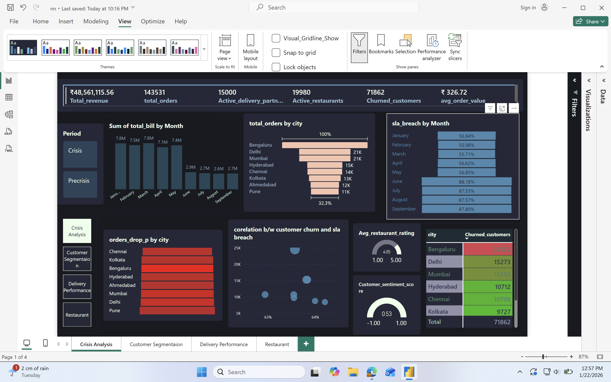
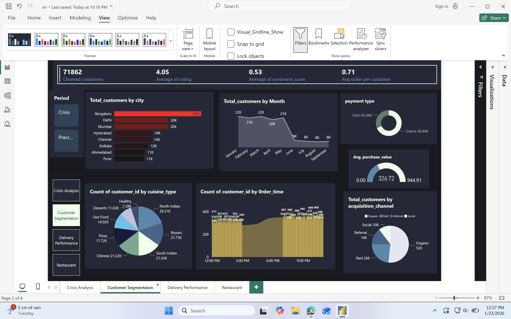
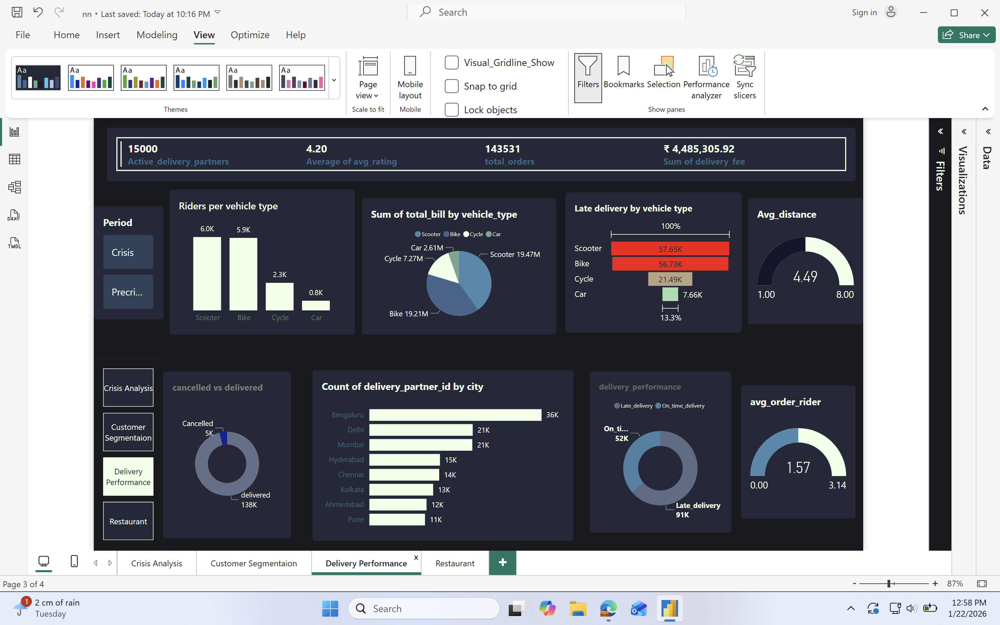
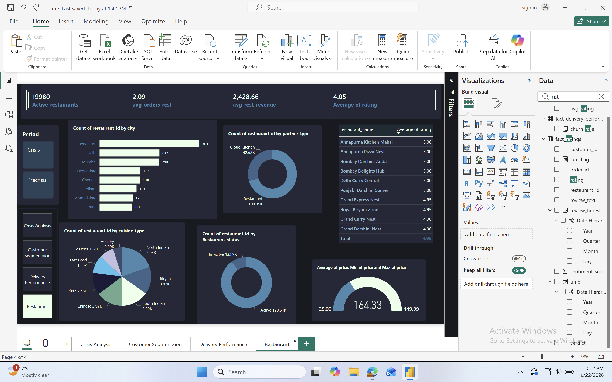

# Quick Byte – Crisis & Churn Analysis (Power BI Dashboard)

## 📌 Project Overview

This project is an **end-to-end crisis and customer churn analysis** for *Quick Byte*, a food delivery platform, built using **Power BI**. The dashboard analyzes how an operational crisis impacted **customer behavior, delivery performance, and restaurant metrics**, and identifies the key drivers behind increased churn.

The project is designed as a **portfolio-ready business intelligence case study**, showcasing interactive dashboards, KPI tracking, and actionable insights for decision-makers.

---

## ❓ Business Problem

Quick Byte experienced a sharp decline in orders and a rise in customer churn during a crisis period. The business needed answers to:

* What changed during the crisis compared to the pre-crisis period?
* Which cities, customer segments, and delivery factors were most affected?
* How did SLA breaches and delivery delays impact customer churn and sentiment?

---

## 📊 Dashboard Structure

The Power BI report consists of **four interactive pages**:

### 1️⃣ Crisis Analysis

* Total revenue, total orders, active partners & restaurants
* Monthly revenue and order trends (Pre-crisis vs Crisis)
* SLA breach % by month
* City-wise churned customers and order drops
* Correlation between SLA breaches and customer churn

**Key Insight:** SLA breaches increased sharply during the crisis, directly correlating with higher churn.

---

### 2️⃣ Customer Segmentation

* Total customers & churned customers
* City-wise customer distribution
* Customer trends by month
* Cuisine preferences
* Order time behavior
* Acquisition channels (Organic, Paid, Referral, Social)
* Payment type split (Online vs Cash)

**Key Insight:** High-volume cities like Bengaluru and Delhi contributed most to churn, making them priority retention targets.

---

### 3️⃣ Delivery Performance

* Active delivery partners
* Riders by vehicle type
* Late deliveries by vehicle type
* Cancelled vs delivered orders
* Delivery partner distribution by city
* Average distance and orders per rider

**Key Insight:** Scooter and bike deliveries accounted for the majority of late deliveries, indicating capacity and routing challenges.

---

### 4️⃣ Restaurant Analysis

* Active restaurants and average ratings
* Restaurant distribution by city
* Partner type (Cloud kitchen vs Restaurant)
* Cuisine distribution
* Restaurant status (Active vs Inactive)
* Pricing analysis (Avg, Min, Max price)

**Key Insight:** Despite stable restaurant ratings, operational issues—not food quality—were the primary drivers of churn.

---

# dashboard preview
## 🎥 Dashboard Walkthrough

▶️ [Watch the Dashboard Walkthrough](video_presentation/REC-20260122233319.mov)

## 🔍 Key Insights Summary

* 📉 Orders and revenue dropped significantly during the crisis period
* ⏱️ **SLA breaches showed a strong positive correlation with customer churn** — as late deliveries increased, churn rose sharply
* 😟 Customer sentiment declined alongside delayed deliveries
* 🏙️ Bengaluru, Delhi, and Mumbai showed the highest churn volumes
* 🛵 Scooter and bike deliveries were the most delay-prone

---

## 💡 Business Recommendations

* Strengthen SLA monitoring with real-time alerts
* Optimize delivery partner allocation during peak hours
* Prioritize retention campaigns in high-churn cities
* Improve crisis communication with proactive customer notifications
* Incentivize on-time delivery performance for partners

---

## 🛠 Tools & Technologies

* **Power BI** (Data modeling, DAX, interactive dashboards)
* Data cleaning & transformation
* KPI design & business metrics
* Data storytelling & visualization

---

## 📁 Project Files

* `Quick_Byte_Crisis_Churn_Analysis.pbix` – Power BI dashboard
* `Screenshots/` – Dashboard visuals

---

## 🚀 Why This Project Matters

This project demonstrates how **data-driven dashboards** can help businesses respond effectively to crises, reduce customer churn, and improve operational resilience.

---

## 👤 About Me

I’m an aspiring **Data Analyst / Business Intelligence Analyst** with a strong interest in customer analytics, churn modeling, and operational performance. This project reflects my ability to convert complex data into clear business insights.

📫 *Open to feedback, collaboration, and opportunities!*
